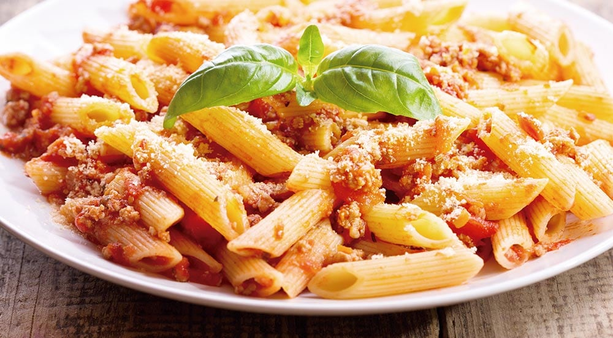
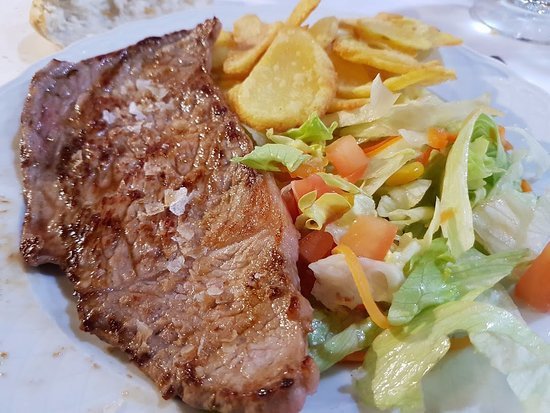
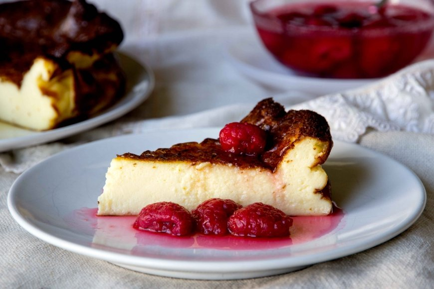

# Menú de medio dia

Para no perder la energía y seguir disfrutando de nuestro día a día tenemos un menú de medio día con el que probablemente nos chuparemos los dedos.

Como primer plato tenemos:

- Macarrones a la boloñesa.

Para no quedarnos con hambre tenemos nuestro segundo plato:

- Bistec de ternera con guarnición.

Por si todavía te queda algún hueco para rellenar, acabamos con nuestro maravilloso postre:

- Tarta de queso

